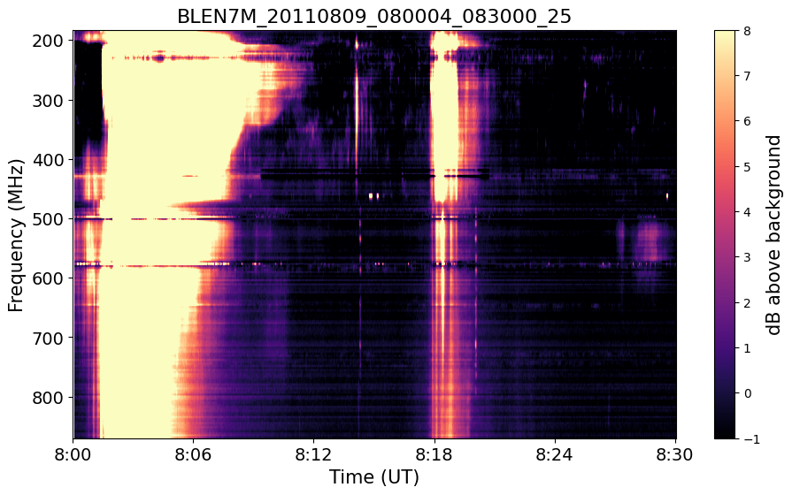

<p align="center"></p>

<h2 align="center">Python library for analyzing data from the e-Callisto International Network of Solar Radio Spectrometers</h1>

<p align="center">
<a href="https://github.com/andrekorol/pycallisto/blob/master/LICENSE"></a>
<a href="https://github.com/psf/black"></a>
<a href="https://app.fossa.com/projects/git%2Bgithub.com%2Fandrekorol%2Fpycallisto?ref=badge_shield" alt="FOSSA Status"></a>
</p>

## Installation and usage

### Installation

**_⚠️WARNING⚠️ PyCallisto is still under development, and breaking changes should be expected._**

PyCallisto is not available on [PyPi](https://pypi.org/) yet but, if you have Git installed, you can get it with:

`git clone https://github.com/andrekorol/pycallisto.git`

Otherwise, download it from https://github.com/andrekorol/pycallisto/archive/master.zip and unzip the master branch.

Once inside the package top directory, run `python setup.py install` as usual.

### Usage

To test the library and its simplicity with some sample data, download these two FITS files from e-Callisto ([BLEN7M_20110809_080004_25.fit.gz](http://soleil80.cs.technik.fhnw.ch/solarradio/data/2002-20yy_Callisto/2011/08/09/BLEN7M_20110809_080004_25.fit.gz) and [BLEN7M_20110809_081504_25.fit.gz](http://soleil80.cs.technik.fhnw.ch/solarradio/data/2002-20yy_Callisto/2011/08/09/BLEN7M_20110809_081504_25.fit.gz)) and then run the following code from a Python interpreter:

```Python
from pycallisto import fitsfile

fits_file_list = [
    "BLEN7M_20110809_080004_25.fit.gz",
    "BLEN7M_20110809_081504_25.fit.gz",
]

fitsfile.ECallistoFitsFile.plot_fits_files_list(fits_file_list, show=True)
```

The resulting plot is:

<p align="center"></p>

## [License](https://github.com/andrekorol/pycallisto/blob/master/LICENSE)

PyCallisto is [free software](https://www.gnu.org/philosophy/free-sw.en.html): you can redistribute it and/or modify
it under the terms of the [GNU General Public License](<https://tldrlegal.com/license/gnu-general-public-license-v3-(gpl-3)>) as published by
the Free Software Foundation, either version 3 of the License, or
(at your option) any later version.

[](https://app.fossa.com/projects/git%2Bgithub.com%2Fandrekorol%2Fpycallisto?ref=badge_large)
